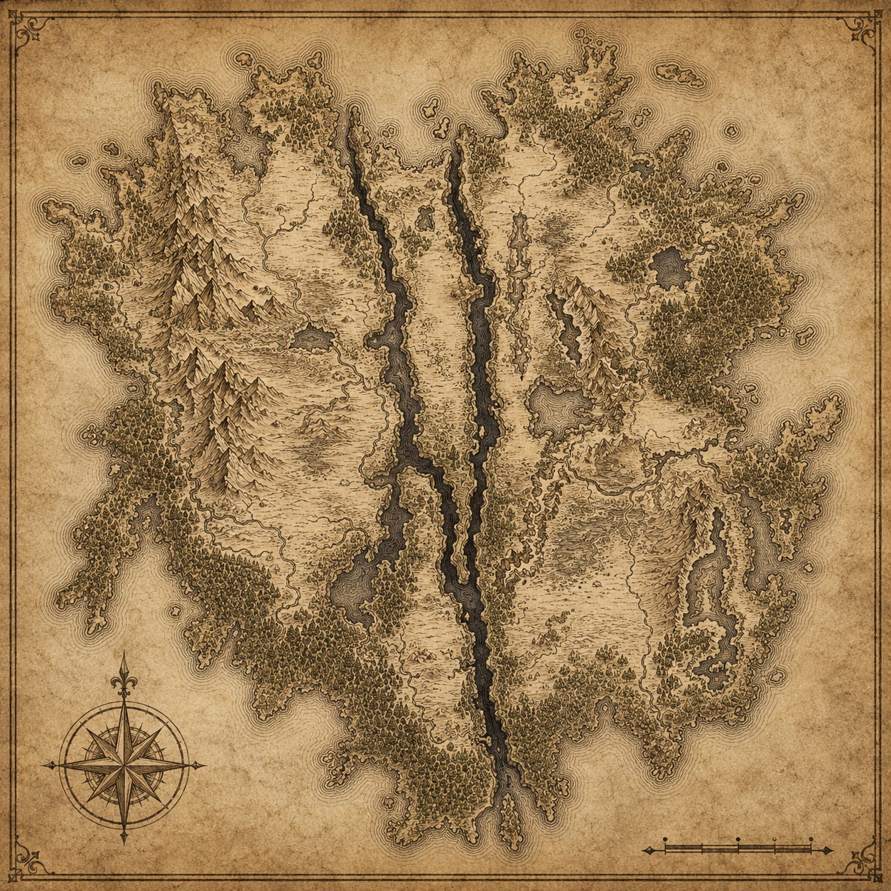

# Arkhaven

Arkhaven is a major continent of [Lazuril](../World/Lazuril.md).

The continent is defined by extreme geographic variation, fractured religious history, large wilderness regions, and the lasting influence of ancient catastrophic events.

Its best known physical feature is [The Godscar](../../Lore/Historical%20Events/The%20Godscar.md), a massive system of vertical fractures, lakes, cliffs, waterways, and broken terrain that divides large areas of the continent.

## Geography

Arkhaven contains multiple major biomes and climate zones.

These include:

- Tropical rainforest
- Savanna
- Grassland
- Hot desert
- Cold desert
- Temperate forest
- Temperate rainforest
- Taiga
- Tundra
- Glacial mountain regions

This environmental variation has contributed to major cultural, political, and economic differences between regions.

## Major Regions

The south-western forests are strongly associated with elven civilisation and [The Green Silence](../../Lore/Historical%20Events/The%20Green%20Silence.md).

The south-eastern mountains are dominated by dwarven kingdoms, mining settlements, and deep tunnel systems.

The central regions contain large grasslands, trade routes, agricultural territories, and several major human population centres.

Northern regions are generally hotter, more humid, and less politically unified.

## Population

Humans are the most widespread population group across Arkhaven.

Large elven and dwarven populations also exist, alongside smaller populations of other peoples.

Population density varies significantly between regions.

Large sections of the continent remain sparsely settled due to terrain, climate, political instability, or historical danger.

## Religion

Religion plays a major role throughout Arkhaven.

Most major churches operate within the framework of [The Scriptor Compact](../../Lore/Historical%20Events/The%20Scriptor%20Compact.md).

The legacy of [War of the False Saints](../../Lore/Historical%20Events/War%20of%20the%20False%20Saints.md) continues to influence how miracles, relics, prophecy, and sainthood are treated.

## Trade and Travel

Trade routes connect much of the continent through roads, rivers, mountain passes, coastal shipping routes, and pilgrimage paths.

Travel remains difficult in several regions due to:

- Dangerous terrain
- Wilderness
- Political borders
- Religious conflict
- Monster activity
- Weather conditions
- Poor infrastructure

Control of strategic crossings and mountain passes remains politically important.

## Current Status

Arkhaven remains politically fragmented.

No single power controls the entire continent.

Several kingdoms, churches, city-states, guilds, archive houses, and regional powers compete for influence.

Ancient history continues to affect modern politics, especially in regions connected to the Godscar, the Green Silence, and older subterranean structures.
